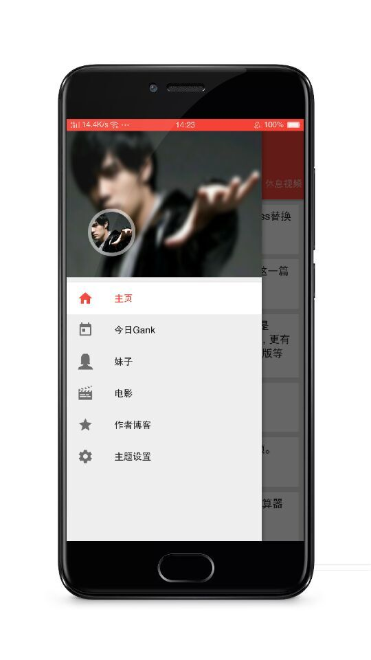
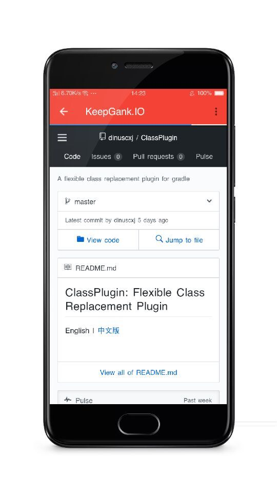
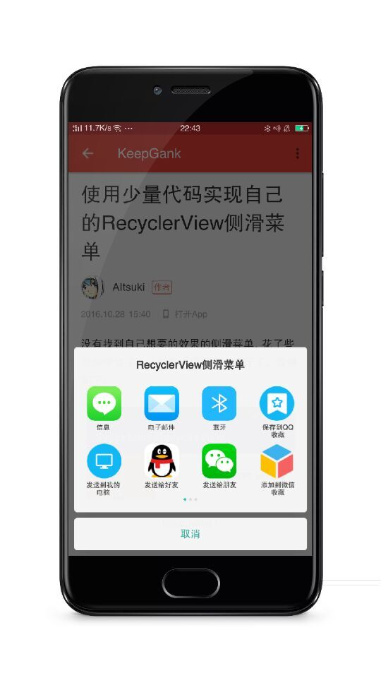
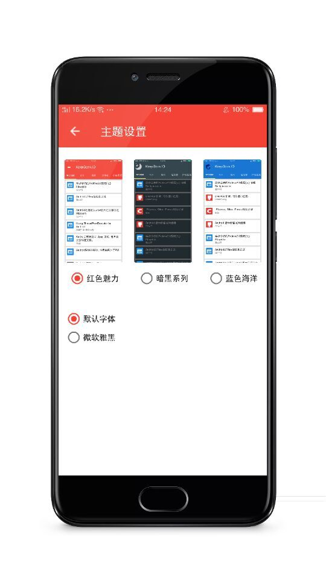
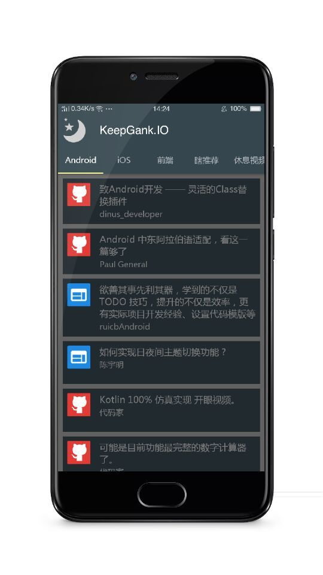

KeepGank.IO
---

一款Gank客户端,阅读本工程代码您将学习到：
- RxJava + Retrofit + Glide的使用
- DiskLruCache的封装
- 常见Material-Design效果的设计
- 如何设计插件化主题包
- 如何使用装饰模式对RecyclerView进行扩展
- 如何编写复用性强的RecyclerView的Adapter,使得每个Item即是独立的Bean又是可复用的Item
- Arouter的路由框架的使用
- 搭建Android5.0水波动画框架
- 如何使用ViewPager打造出超炫浏览界面
- 如何使用贝塞尔曲线打造Loading界面
- 如何使用ViewPager打造出超炫的图片选择界面

---

## 主体

RxJava + Retrofit + Glide + DiskLruCache + Material-Design

## 缘由

本着学习MD军火库的目的, 外加练习一下使用第三方框架, 毕竟在公司很少使用第三方的框架. 于是写了个Gank.io客户端. 本打算写一个笑话大全类的客户端, 想着代码家大神比那些第三方网站靠谱的多. 其实都一样. 不如写Gank.io了


## 仓库 (希望大家多多Star)
[https://github.com/Jerey-Jobs/KeepGank](https://github.com/Jerey-Jobs/KeepGank)

## APK下载

[App下载链接](http://www.coolapk.com/apk/com.jerey.keepgank)


版本记录
---
#### 1.0
1. 主页为Gank分类
2. 每日Gank
3. 我的博客)
4. Disk数据缓存，避免下次打开时无网络, 加载老数据
5. 图片大图浏览效果
6. 图片保存
7. 瀑布流妹子浏览
8. 内容分享
9. 夜间模式

#### 1.1
1. 增加揭面水波动画

#### 1.2
1. 增加多主题框架，并内置了两个主题包
2. 增加字体选择，应用内支持微软雅黑
3. 启动模式不再白屏
4. 主题切换不再有过渡动画

#### 1.3
1. 增加头像选择功能， 滑动浏览
2. 使用多类型扩展Adapter增加豆瓣电影界面

### 预览
---
<a></a>
<a></a>
<a></a>
<a></a>
<a></a>
<a></a>
<a></a>
<a></a>
<a></a>
<a></a>
<a></a>
<a></a>


### 头像选择
<a></a>

### 总之, 希望大家多多star, 一起进步

### 目前用到的依赖有：

Gson | Google json解析库
--- | ---
Swipebacklayout | 滑动返回库
Butterknife | jakewharton的注解绑定库
Glide | 图片加载框架
RxJava | 一个对于构成使用的Java虚拟机观察序列异步和基于事件的程序库
Rxbus | 事件总线
Rxlifecycle | RxJava生命周期绑定库
Retrofit2 | 网络请求库
joda-time | 时间管理库
Realm-android | Realm数据库
Umeng.analytics | 友盟统计
Arouter | 阿里巴巴开源路由框架
MaterialDateTimePicker | 一个Material-Design风格的TimePicker


----------
作者:Anderson大码渣，欢迎关注我的简书: [Anderson大码渣](http://www.jianshu.com/u/016a5ba708a0) <br>
欢迎关注我的Github:  [Jerey-Jobs](https://github.com/Jerey-Jobs)

-------
## License

```
Copyright 2017 Jerey-Jobs.

Licensed under the Apache License, Version 2.0 (the "License");
you may not use this file except in compliance with the License.
You may obtain a copy of the License at

   http://www.apache.org/licenses/LICENSE-2.0

Unless required by applicable law or agreed to in writing, software
distributed under the License is distributed on an "AS IS" BASIS,
WITHOUT WARRANTIES OR CONDITIONS OF ANY KIND, either express or implied.
See the License for the specific language governing permissions and
limitations under the License.
```
